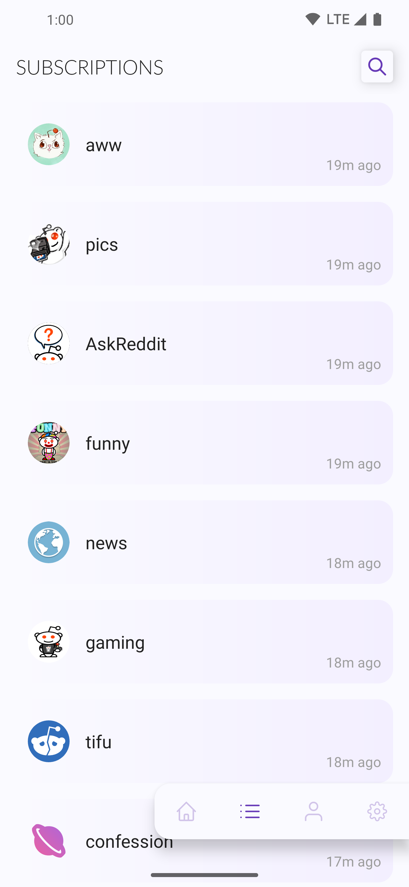
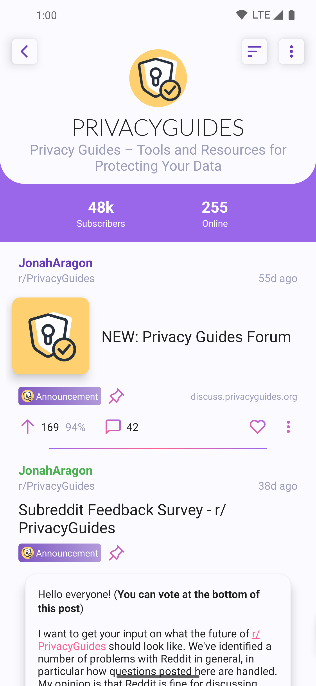

# Stealth for Reddit

 

Stealth is an account-free, privacy-oriented, and feature-rich Reddit client. 

It provides features from Reddit, without the need for an account. In fact, the app doesn't even let you log in with a Reddit account.

## Screenshots

## Features

- Browse Reddit (view posts, comments, subreddits, and users)
- Search posts, subreddits and users
- Subscribe to subreddits
- Sort
- History
- Show/hide NSFW content
- Image flairs
- Awards
- Light/Dark theme

 ### More to come

 - Save posts and comments
 - Save photos and videos
 - Remind-Me
 - and more...

## License

Copyright 2021 CosmosDev

Licensed under the GPLv3: http://www.gnu.org/licenses/gpl-3.0.html
